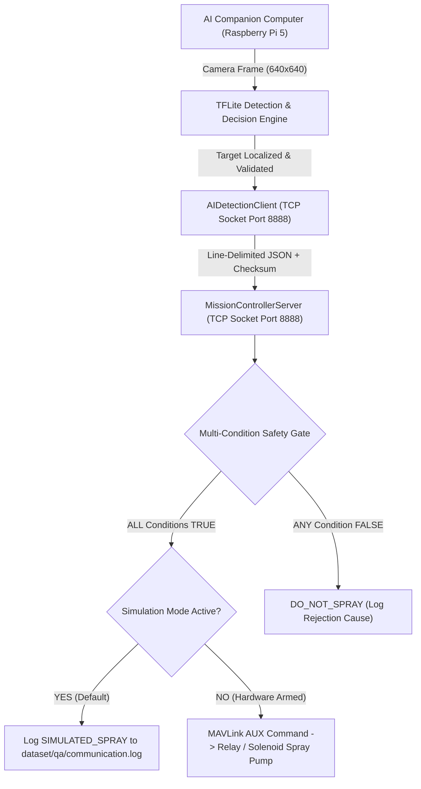

# Quadcopter AI Companion Computer to Mission Controller Interface

**Project:** Autonomous Agricultural Quadcopter for Targeted Weed Detection & Precision Spraying  
**Target Event:** Smart India Hackathon (SIH) 2026  
**Document Scope:** Communication Interface Protocol, Message Schema & Multi-Condition Safety Gate  
**Implementation Modules:** [`communication/messages.py`](file:///c:/Users/mishr/OneDrive/Documents/crop-seggregation-model/communication/messages.py), [`communication/protocol.py`](file:///c:/Users/mishr/OneDrive/Documents/crop-seggregation-model/communication/protocol.py), [`communication/server.py`](file:///c:/Users/mishr/OneDrive/Documents/crop-seggregation-model/communication/server.py), [`communication/client.py`](file:///c:/Users/mishr/OneDrive/Documents/crop-seggregation-model/communication/client.py)  

---

## 1. System Architecture & Inter-Process Communication Flow



---

## 2. Standardized Message Schema Specification

### 2.1 Request Payload (AI Companion Computer -> Mission Controller)

```json
{
  "sequence_id": 1001,
  "timestamp": 1776543210.123,
  "target_detected": true,
  "class": "weed",
  "confidence": 0.9125,
  "bbox": [264.42, 124.13, 346.77, 205.15],
  "pixel_center": [305.6, 164.64],
  "ground_offset": [0.1042, 0.2015],
  "nozzle_offset": [-0.0458, 0.0015],
  "spray_eligible": true,
  "crop_conflict": false,
  "checksum": "e4d2f8a1"
}
```

### 2.2 Server Acknowledgment Payload (Mission Controller -> AI Companion Computer)

```json
{
  "ack_sequence_id": 1001,
  "status": "SPRAY_REQUEST_APPROVED",
  "action": "SIMULATED_SPRAY_LOGGED (Hardware Pump Disarmed)",
  "timestamp": 1776543210.145
}
```

---

## 3. MANDATORY MULTI-CONDITION SAFETY RULE

> [!CAUTION]
> **CRITICAL SAFETY REQUIREMENT:** AI detection alone MUST NEVER directly activate physical hardware spray pumps. The Mission Controller enforces an absolute multi-condition boolean truth table. Every condition must evaluate to `True` before a spray request is approved.

### Safety Gate Truth Table Expression:

$$\text{SPRAY\_REQUEST} = \begin{cases} 
\text{APPROVED}, & \text{if } \text{weed\_detected} \land (\text{confidence} \ge 0.70) \land \text{target\_valid} \land \neg\text{crop\_conflict} \land \text{drone\_valid} \land \text{comm\_healthy} \land \text{system\_armed} \\
\text{DENIED}, & \text{otherwise}
\end{cases}$$

| Boolean Safety Condition | Required Value | Operational Purpose |
| :--- | :---: | :--- |
| `weed_detected` | `True` | Valid weed classification from neural network. |
| `confidence >= 0.70` | `True` | Calibrated model confidence meets operational threshold. |
| `target_valid` | `True` | Target passes size, area, and boom reach constraints. |
| `crop_conflict == False` | `True` | No spatial overlap ($\text{IoU} \le 0.25$) with adjacent crops. |
| `drone_in_valid_state` | `True` | Quadcopter altitude $1.8\text{ m} \le H \le 2.5\text{ m}$, airspeed $\le 5.0\text{ m/s}$, and flight mode `AUTO`. |
| `communication_valid` | `True` | Socket link active, sequence numbers continuous, message age $\le 2.0\text{ s}$. |
| `spray_system_armed` | `True` | Master hardware spray arm switch engaged by drone pilot. |

---

## 4. Simulation Mode & Safety Provisions

1. **Hardware Trigger Disabled by Default:** `hardware_trigger_enabled = False`. Physical GPIO pins and MAVLink AUX relays are disarmed by default.
2. **Telemetry Logging:** All evaluations, approved triggers, and rejection causes are appended to `dataset/qa/communication.log`.
3. **Sequence Deduplication:** Out-of-order or duplicate `sequence_id` messages are automatically rejected by the protocol decoder.
4. **Cryptographic Checksum:** MD5 checksums verify message payload integrity against corruption during inter-process socket transmission.
