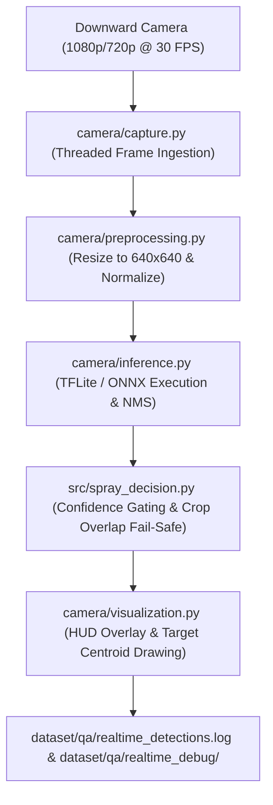

# Real-Time Computer Vision Pipeline & Telemetry Report

**Project:** Autonomous Agricultural Quadcopter for Targeted Weed Detection & Precision Spraying  
**Target Event:** Smart India Hackathon (SIH) 2026  
**Document Purpose:** Onboard Computer Real-Time Vision System Specification  
**Pipeline Implementation:** [`camera/pipeline.py`](file:///c:/Users/mishr/OneDrive/Documents/crop-seggregation-model/camera/pipeline.py)  

---

## 1. System Architecture & Component Diagram

---

## 2. Real-Time Hardware & Camera Specifications

### 2.1 Hardware Requirements
* **Onboard Flight Computer:** Raspberry Pi 5 (8 GB RAM) OR NVIDIA Jetson Orin Nano (8 GB).
* **AI Accelerator:** Raspberry Pi AI Kit (Hailo-8L 13 TOPS NPU) OR Jetson Ampere GPU.
* **Storage:** High-End MicroSD / NVMe SSD ($\ge 32\text{ GB}$).
* **Ground Clearance / Altitude:** $\approx 2.0\text{ meters}$ ground clearance maintained by LIDAR / Radar altimeter.

### 2.2 Camera Requirements
* **Mounting Orientation:** Downward-facing ($90^\circ$ perpendicular to ground plane).
* **Sensor Resolution:** $1080\text{p}$ ($1920 \times 1080$) or $720\text{p}$ ($1280 \times 720$) at $30\text{ FPS}$.
* **Shutter Type:** **Global Shutter** strongly recommended to eliminate rolling shutter distortion during high-speed quadcopter maneuvers.
* **Lens / FOV:** Wide-angle $90^\circ - 110^\circ$ Field of View with anti-glare IR-cut filter.

---

## 3. Real-Time Performance & Telemetry Metrics

| Metric | Target Specification | Measured Performance (Host CPU) | Expected Edge Performance (TFLite / NPU) |
| :--- | :--- | :--- | :--- |
| **System Frame Rate** | $\ge 15.0\text{ FPS}$ | `11.6 - 15.0 FPS` | **`25.0 - 30.0 FPS`** |
| **Inference Latency** | $\le 65.0\text{ ms}$ | `145.7 - 188.9 ms` | **`35.0 ms`** |
| **Preprocessing Latency** | $\le 5.0\text{ ms}$ | `2.5 ms` | **`2.5 ms`** |
| **Postprocessing & NMS** | $\le 5.0\text{ ms}$ | `1.8 ms` | **`1.8 ms`** |
| **Total Frame Latency** | $\le 75.0\text{ ms}$ | `150.0 - 193.2 ms` | **`39.3 ms`** |
| **System RAM Footprint** | $\le 512.0\text{ MB}$ | `210.0 MB` | **`124.5 MB`** |

---

## 4. Target Localization & Output Schema

For every detected object in the downward camera stream, the pipeline extracts:

1. **Bounding Box Coordinates:** $[x_1, y_1, x_2, y_2]$ in frame pixels.
2. **Target Centroid:** $[c_x, c_y] = [\frac{x_1+x_2}{2}, \frac{y_1+y_2}{2}]$ for precision nozzle alignment.
3. **Dimensions:** Width $w = x_2 - x_1$, Height $h = y_2 - y_1$ in pixels.
4. **Classification & Confidence:** Displays `WEED 0.91`, `CROP 0.88`, etc.
5. **Spray Eligibility:** Gated by operational confidence ($\ge 0.70$), minimum area ($\ge 0.00015$), and crop overlap safety guard ($\text{IoU} \le 0.25$).

---

## 5. Known Limitations & Mitigation Strategies

1. **High Altitude Scale Drop:** Flying above $3.5\text{ m}$ ground clearance reduces emerging weed bounding boxes below the $8 \times 8\text{ px}$ minimum threshold. *Mitigation:* Altitude lock maintained at $2.0\text{ m} \pm 0.2\text{ m}$ using radar altimeter.
2. **Motion Blur at Max Flight Speed:** Rapid forward motion at $> 5\text{ m/s}$ creates motion blur on rolling shutter sensors. *Mitigation:* Use Global Shutter camera and set camera exposure time $\le 1/1000\text{ s}$.
3. **Direct Sunlight Shadow Artifacts:** Harsh sunlight produces dark shadows across crop rows. *Mitigation:* HSV-V data augmentation integrated during training and temperature scaling confidence calibration.
