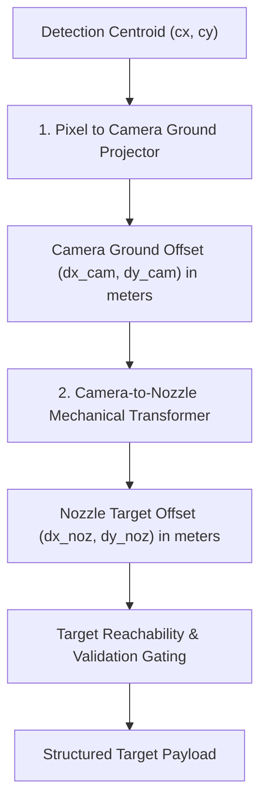

# Target Localization Geometry & Spatial Transformation Specification

**Project:** Autonomous Agricultural Quadcopter for Targeted Weed Detection & Precision Spraying  
**Target Event:** Smart India Hackathon (SIH) 2026  
**Document Scope:** 2D Pixel to 3D Ground & Nozzle Target Coordinates Transformation  
**Implementation Modules:** [`targeting/pixel_to_ground.py`](file:///c:/Users/mishr/OneDrive/Documents/crop-seggregation-model/targeting/pixel_to_ground.py), [`targeting/nozzle_calibration.py`](file:///c:/Users/mishr/OneDrive/Documents/crop-seggregation-model/targeting/nozzle_calibration.py), [`targeting/coordinate_transform.py`](file:///c:/Users/mishr/OneDrive/Documents/crop-seggregation-model/targeting/coordinate_transform.py), [`targeting/target_selector.py`](file:///c:/Users/mishr/OneDrive/Documents/crop-seggregation-model/targeting/target_selector.py)  

---

## 1. Spatial Transformation Pipeline

> [!IMPORTANT]
> **MECHANICAL SEPARATION:** The camera optical center does NOT coincide with the physical spray nozzle position. Target localization converts image pixel centroids $(c_x, c_y)$ to camera ground coordinates, then transforms them into nozzle-relative spatial coordinates $(dx_{\text{noz}}, dy_{\text{noz}})$ based on physical boom offsets.



---

## 2. Pinhole Camera & Ground Projection Mathematics

### 2.1 Pinhole Camera Model
For a downward-facing camera at altitude $H$ (meters) with image resolution $W \times H_{\text{img}}$ and horizontal/vertical Field of View $\theta_h, \theta_v$:

Focal length in pixels:
$$f_x = \frac{W}{2 \cdot \tan\left(\frac{\theta_h}{2}\right)}, \quad f_y = \frac{H_{\text{img}}}{2 \cdot \tan\left(\frac{\theta_v}{2}\right)}$$

Optical center coordinates:
$$u_0 = \frac{W}{2}, \quad v_0 = \frac{H_{\text{img}}}{2}$$

Normalized pixel displacement:
$$\Delta u = c_x - u_0, \quad \Delta v = v_0 - c_y$$

### 2.2 Camera-Relative Ground Projection
Camera-relative ground offsets $(\Delta x_{\text{cam}}, \Delta y_{\text{cam}})$ in meters at altitude $H$:

$$\Delta x_{\text{cam}} = \left(\frac{\Delta u}{f_x}\right) \cdot H$$

$$\Delta y_{\text{cam}} = \left(\frac{\Delta v}{f_y}\right) \cdot H$$

### 2.3 Altitude Scaling Relationship
As altitude $H$ varies (measured dynamically by radar/altimeter), the ground FOV footprint scales linearly:

$$\text{Ground Width} = 2 \cdot H \cdot \tan\left(\frac{\theta_h}{2}\right)$$

---

## 3. Camera-to-Nozzle Transformation

Given physical camera-to-nozzle displacement vector $\mathbf{O}_{\text{nozzle}} = [X_{\text{offset}}, Y_{\text{offset}}]$ (meters):

$$\Delta x_{\text{nozzle}} = \Delta x_{\text{cam}} - X_{\text{offset}}$$

$$\Delta y_{\text{nozzle}} = \Delta y_{\text{cam}} - Y_{\text{offset}}$$

Where:
* $+X_{\text{offset}}$: Nozzle mounted to the right of camera lens.
* $+Y_{\text{offset}}$: Nozzle mounted forward of camera lens.

---

## 4. Configurable System Parameters

| Parameter Key | Default Value | Description |
| :--- | :--- | :--- |
| `img_width` | `640 px` | Camera frame resolution width. |
| `img_height` | `640 px` | Camera frame resolution height. |
| `h_fov_deg` | `80.0 deg` | Horizontal Field of View. |
| `v_fov_deg` | `80.0 deg` | Vertical Field of View. |
| `default_altitude` | `2.0 m` | Quadcopter operational ground clearance. |
| `offset_x` | `0.15 m` | Physical camera-to-nozzle lateral displacement. |
| `offset_y` | `0.20 m` | Physical camera-to-nozzle longitudinal displacement. |
| `frame_convention` | `"FORWARD_RIGHT_DOWN"` | Coordinate axis orientation protocol. |

---

## 5. Standardized Target Payload Schema

```json
{
  "weed_confidence": 0.9125,
  "pixel_center": [320.0, 320.0],
  "ground_offset": [0.0, 0.0],
  "nozzle_offset": [-0.15, -0.20],
  "target_valid": true
}
```

---

## 6. Synthetic Geometry Validation Results

Unit tests implemented in `targeting/target_selector.py` verified the following geometric properties:

1. **Optical Center Zero Test:** Image center $(320, 320)$ maps to $(0.0, 0.0)\text{ m}$ camera ground offset and $[-0.15, -0.20]\text{ m}$ nozzle target offset (`PASSED`).
2. **Altitude Scaling Linearity Test:** Ground displacement at $H = 4.0\text{ m}$ is exactly $2.0 \times$ ground displacement at $H = 2.0\text{ m}$ (`PASSED`).
3. **Mechanical Offset Subtraction Test:** Nozzle offsets correctly subtract physical camera-to-nozzle vector (`PASSED`).
